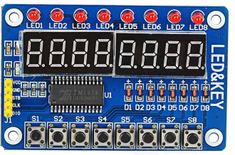

# Twiddler

A bit-twiddler binary math toy :)

Twiddler is a fun toy for learning `binary` (base 2) and `hexidecimal` (base 16) math.

It's intended as a learning tool for young & old, beginner through to pro.

It's particularly useful for computer programmers who often use different numerical bases in their code and would like a way to visualize them.

## Motivation

I really just wanted a tactile and visual tool for better understaning non-decimal number systems.

## Twiddler overview

The device allows you to edit up to 4x 8-bit bytes. These bytes represent a single 32-bit unsigned integer.

The input buttons allow the you to interact with each byte, and to modify each individual bit within the currently selected byte.

Twiddler has 4 display modes. These modes change which numerical base is used to display the state (`decimal`, `hexadecimal`, `binary` & the special `font` mode).

## Paging

The rightmost byte is shown by default, a user can switch which byte is currently being viewed and edited.

## Device overview



### LEDs

Along the top edge there are eight LEDs which display a binary representation of the currently selected byte.

For example, the binary number `101010101` would result in every second LED lighting up. For each `1` the light is on and for each `0` it is off.

### Display

The display consists of 8x [seven-segment displays](https://en.wikipedia.org/Seven-segment_display), with a decimal indicator dot at the bottom right corner of each.

These displays can be used to represent numbers and letters, although representing English characters is fairly limited (eg. the letter `w`).

In the default `decimal` mode, the display will show a `decimal` (base 10) representation of your twiddle.

The dots at the bottom right corner of each display are used to indicate application state, such as the currently deleted mode and byte.

### Buttons

Along the bottom edge of the device are 8x buttons. These buttons are used to interact with the device.

When a single button is pressed and released, the corresponding bit will be toggled.

Fo example: pushing button `S2` will toggle corresponding bit, which will cause `LED2` to light up.

### Multi-button combinations

You can hold a trigger button with one finger and then press a second button with another finger to trigger advanced actions on the device.

For example: holding button `S8` and then pushing button `S2` will change Twiddler in to `hexadecimal` mode.

Here's a list of all the button combinations, `T` indicates the 'trigger button', you need to hold this button down first, then press and release the second button.

| S1 | S2 | S3 | S4 | S5 | S6 | S7 | S8 | Action |
| - | - | - | - | - | - | - | - | - |
| o | | | | | | | T | Foo |


## Hardware

### Introduction to the TM1638

Check out this excellent intro to the TM1638 chip:
http://tronixstuff.com/2012/03/11/arduino-and-tm1638-led-display-modules/

### Wiring Diagrams

You can find wiring diagrams for both common models, along with info about wiring multiple in parallel here:
https://github.com/zegreatclan/AssettoCorsaTools/wiki/Arduino-Tm1638-Display-Wiring

When wiring your own twiddler you may need to change the pin assignments, at the top of the `src/twiddler.ino` file you'll find a configuration for which pins are attached to data, clock & strope. 

```ardunio
// connect to TM1638 with data pin, clock pin, strobe pin
TM1638 module(5, 6, 7);
```

## Software

## TM1638 device driver

Twiddler uses the device driver written by `rjbatista`, which can be found here:
https://github.com/rjbatista/tm1638-library

Twiddler was originally developed on a `Particle Core v1` chip, so I published the same library on the Particle registry:

```bash
particle library search TM1638
> Found 1 library matching TM1638
TM1638 1.0.0 [mine] 0 A library for interacting an arduino with a TM1638/TM1640
```

## Application code

You can find the source code for the Twiddler application in the `src` directory.